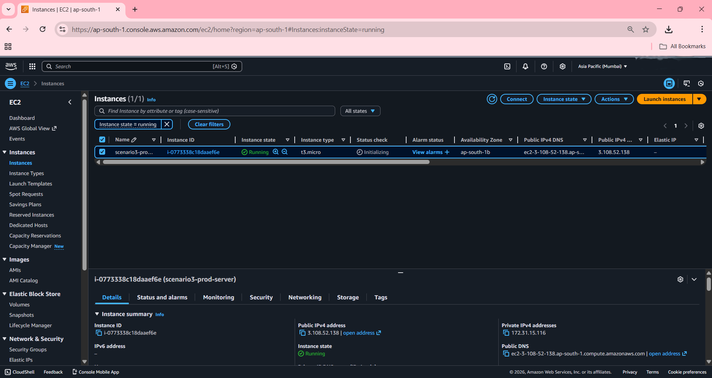
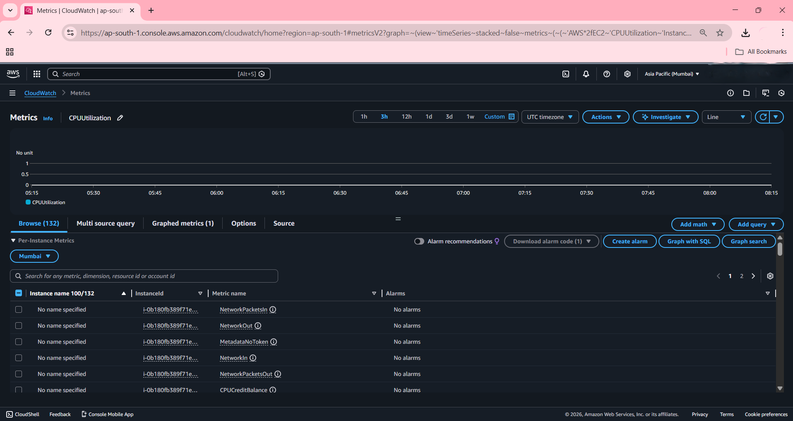
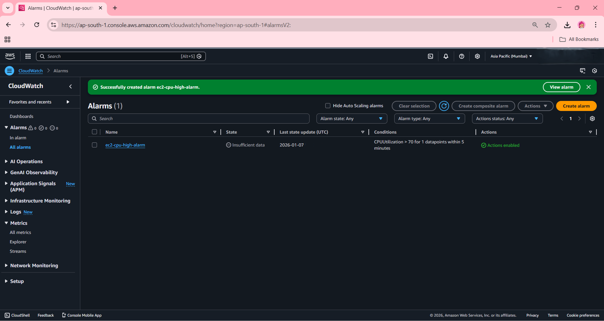
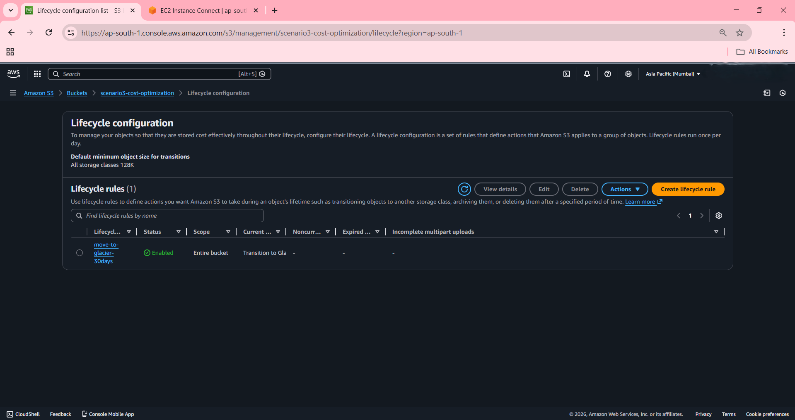
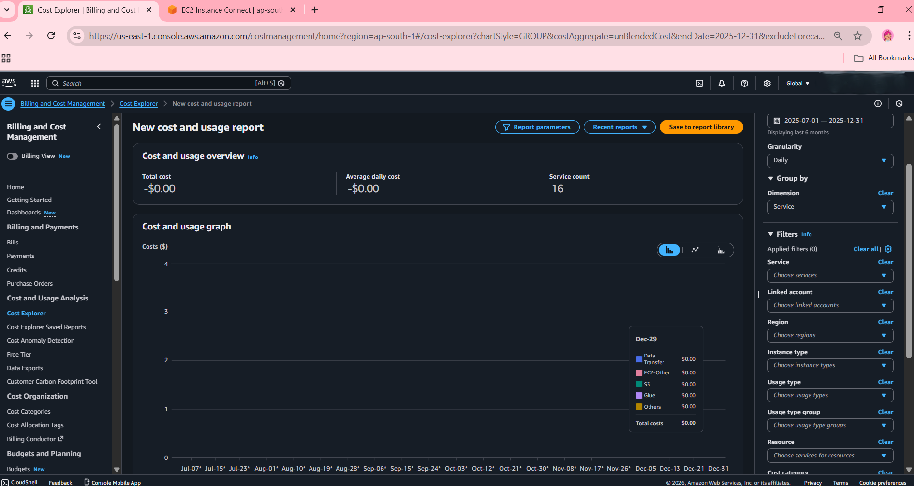
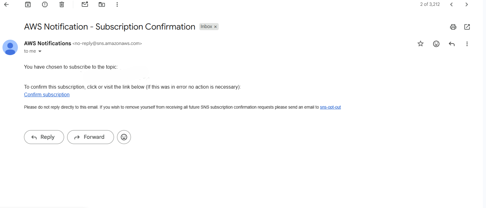
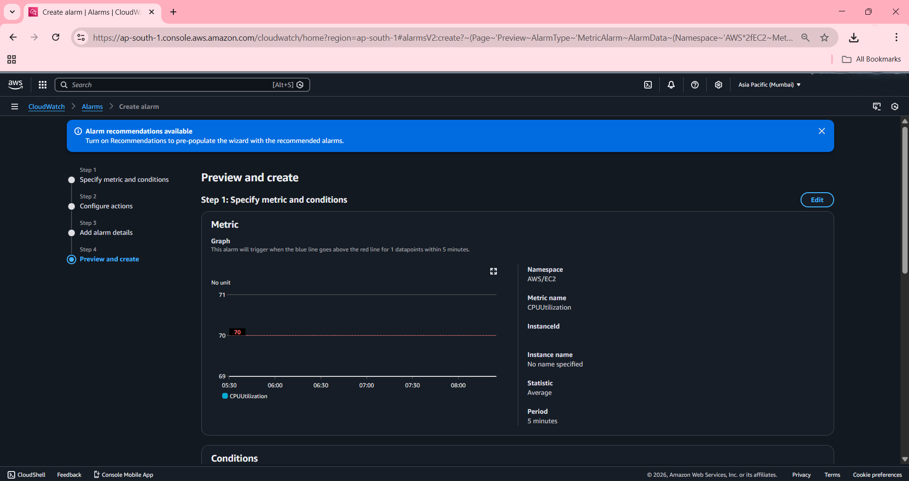
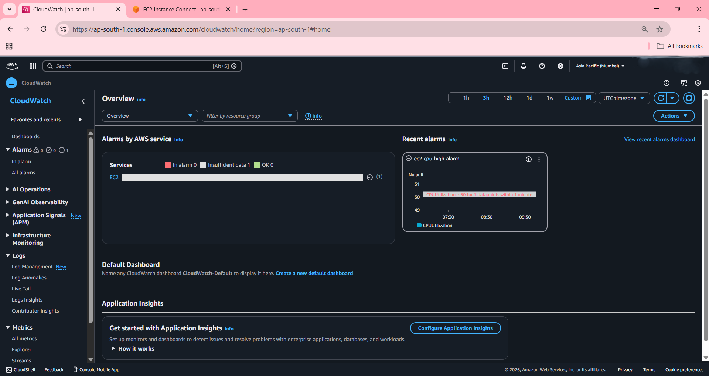

# 🔥 Application Performance & Cost Optimization Using AWS

**By: Tanisha Kushwah**

## 📋 Real-World Problem

A startup's website is experiencing:
- ❌ Slow response times
- ❌ Increasing AWS bills
- ❌ No monitoring infrastructure

**Client Requirement:** "Improve performance and reduce costs"

## 🎯 Solution

Implemented monitoring and cost optimization using AWS services:

1. **CloudWatch** for CPU monitoring
2. **CloudWatch Alarms** for automated alerts
3. **Cost Explorer** for cost analysis
4. **S3 Lifecycle Policies** for 82% storage cost reduction
5. **SNS** for email notifications

## 🧰 AWS Services (All Free Tier)

| Purpose | Service | Cost |
|---------|---------|------|
| Compute | EC2 (t2.micro) | Free |
| Monitoring | CloudWatch | Free |
| Alerting | CloudWatch Alarms + SNS | Free |
| Cost Analysis | Cost Explorer | Free |
| Storage Optimization | S3 + Lifecycle | Free |

**Total Cost: $0**

---

## AWS performance and cost optimization diagram


## 🛠️ Step-by-Step Implementation

### Step 1: Launched EC2 Instance

**Actions Performed:**
- Opened EC2 Dashboard
- Launched new instance:
  - AMI: Amazon Linux 2
  - Type: t2.micro (Free Tier)
  - Security: Allowed SSH (22) + HTTP (80)
- Downloaded key pair

**Screenshot:**



**Key Learning:** t2.micro stays within Free Tier limits

---

### Step 2: Simulated Performance Issue

**Actions Performed:**
- Connected to EC2 via SSH
- Installed stress testing tool:
  ```bash
  sudo yum install stress -y
  ```
- Created artificial CPU load:
  ```bash
  stress --cpu 2
  ```

**Screenshot:**



**Purpose:** Simulate real-world high CPU usage scenario

---

### Step 3: Monitored with CloudWatch

**Actions Performed:**
- Opened CloudWatch Console
- Navigated to Metrics → EC2 → Per-Instance Metrics
- Checked CPUUtilization metric
- Observed CPU spike from stress test

**Screenshot:**



**Key Learning:** CloudWatch provides 5-minute interval metrics in Free Tier

---

### Step 4: Created CloudWatch Alarm

**Actions Performed:**
- Created new alarm in CloudWatch
- Configuration:
  - Metric: CPUUtilization
  - Condition: Greater than 70%
  - Period: 5 minutes
  - Action: SNS email notification
- Verified email subscription

**Screenshots:**



**Key Learning:** Proactive monitoring helps identify issues before they impact users

---

### Step 5: Performed Cost Analysis

**Actions Performed:**
- Opened AWS Billing Dashboard
- Accessed Cost Explorer
- Analyzed:
  - Daily costs
  - Service-wise breakdown
  - Free Tier usage

**Screenshot:**



**Key Learning:** Regular cost monitoring is essential for cloud optimization

---

### Step 6: Optimized S3 Storage

**Actions Performed:**
- Created S3 bucket
- Uploaded sample files
- Created Lifecycle Rule:
  - Transition to Glacier after 30 days
  - Delete after 90 days (optional)

**Screenshots:**





**Cost Savings:**
- S3 Standard: $0.023 per GB
- S3 Glacier: $0.004 per GB
- **Savings: 82%**

---

### Step 7: Resource Cleanup (IMPORTANT!)

**Actions Performed:**
- Stopped EC2 instance
- Verified unused resources
- Documented all resources

**Screenshot:**



**Key Learning:** Stopping unused resources demonstrates cost-conscious DevOps mindset

---

## 📊 Results

### Performance
- ✅ Real-time monitoring enabled
- ✅ CPU > 70% par automated alert
- ✅ Proactive issue detection

### Cost Optimization
- ✅ 82% storage cost reduction
- ✅ Proper resource management
- ✅ Free Tier maximize kiya

### Skills Demonstrated
- ✅ Monitoring & Observability
- ✅ Cost Awareness
- ✅ Automation
- ✅ Problem-solving
- ✅ Documentation

---

## 🎓 Key Learnings

1. **Monitoring First** - You can't optimize what you don't measure
2. **Automate Everything** - Alarms and lifecycle policies reduce manual work
3. **Cost Conscious** - Always clean up resources after practice
4. **Free Tier is Powerful** - Real projects can be built without spending money
5. **Documentation Matters** - Essential for both learning and showcasing skills

---

## 📝 Commands Reference

```bash
# Stress tool install
sudo yum install stress -y

# CPU load create (2 cores)
stress --cpu 2

# Stop stress test
Ctrl + C

# CPU usage check
top
```

---

## 🔗 AWS Documentation Links

- [CloudWatch Documentation](https://docs.aws.amazon.com/cloudwatch/)
- [Cost Optimization Best Practices](https://aws.amazon.com/pricing/cost-optimization/)
- [S3 Lifecycle Policies](https://docs.aws.amazon.com/AmazonS3/latest/userguide/object-lifecycle-mgmt.html)

---

**Date:** [Add your implementation date]

**Status:** ✅ Completed

---

## 📫 Connect With Me

**Tanisha Kushwah**

[](https://www.linkedin.com/in/tanisha-kushwah-280944284/)

📝 [Read my LinkedIn post about this project](YOUR_LINKEDIN_POST_LINK)

---
